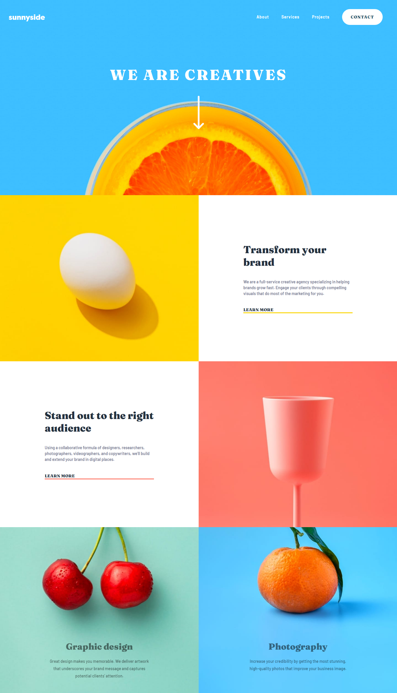

# Frontend Mentor - Sunnyside agency landing page solution

This is a solution to the [Sunnyside agency landing page challenge on Frontend Mentor](https://www.frontendmentor.io/challenges/sunnyside-agency-landing-page-7yVs3B6ef).

## Table of contents

- [Overview](#overview)
  - [Screenshot](#screenshot)
  - [Links](#links)
- [My process](#my-process)
  - [Built with](#built-with)
  - [What I learned](#what-i-learned)
- [Author](#author)

## Overview

### Screenshot




### Links

- Solution URL: [solution](https://github.com/gvnee/ui-practice/tree/main/sunnyside)
- Live Site URL: [live site](https://gvnee.github.io/ui-practice/sunnyside)

## My process

### Built with

- Semantic HTML5 markup
- CSS custom properties
- Flexbox

### What I learned

background image will be centered even in mobile form.
```css
    background-size: cover;
    background-repeat: no-repeat;
    background-position: center;
```

## Author

- Frontend Mentor - [gvnee](https://www.frontendmentor.io/profile/gvnee)
- Github - [gvne](https://github.com/gvnee)
